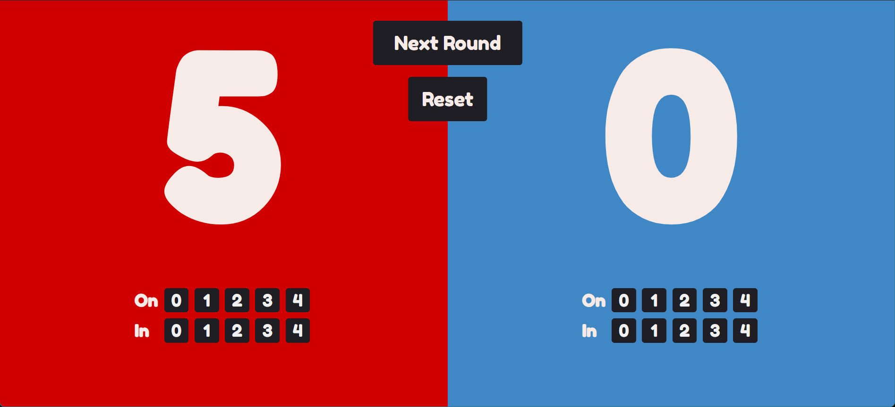

# CornScore: The Ultimate Cornhole Score Tracker

## Overview

CornScore is a sleek and intuitive web app designed to enhance the experience of Cornhole, a beloved lawn game. This application simplifies the scorekeeping process, ensuring you can focus on the fun and strategy of the game without the hassle of manual score tracking.

## Features

- **User-Friendly Interface**: A clear, vibrant display makes it easy to read scores and update them.
- **Score Calculation**: The app automatically calculates the scores when both teams have played, ensuring accuracy and fairness.
- **Round Management**: With a simple click of "Next Round," the app prepares for the next round of play, resetting the points and keeping the game moving smoothly.
- **Responsive Design**: Whether you're using a phone, tablet, or desktop, the score tracker adapts to your device for the best experience.

## How It Works

1. **Enter Points**: Players use the intuitive button grid to input the number of bags on the board ("On") and bags in the hole ("In") for each team.
2. **Next Round**: Once both teams have finished their turn, hit the "Next Round" button to calculate and update the score.
3. **Reset If Needed**: If you need to start a new game or correct an error before the next round, simply press "Reset" to clear the scores and point entries.

## Technologies Used

- **Front-End**: HTML5, CSS3, JavaScript
- **Frameworks/Libraries**: React.js for efficient UI updates and state management.
- **Deployment**: The app is ready to be containerized with Docker and deployed using services like AWS, Heroku, or Netlify.

## Contribution

Interested in contributing to CornScore? We welcome contributions that improve the app's functionality, design, or user experience. Please read through our contribution guidelines before submitting a pull request.

## Contact

For support or to contact the developers, please send an email to [aaron.m.soto1@gmail.com](mailto:aaron.m.soto1@gmail.com).

---

**Note to recruiters**: CornScore showcases my ability to create a full-stack application with a focus on usability and modern web design principles. This project demonstrates my proficiency in software development, problem-solving, and user interface design.

---
